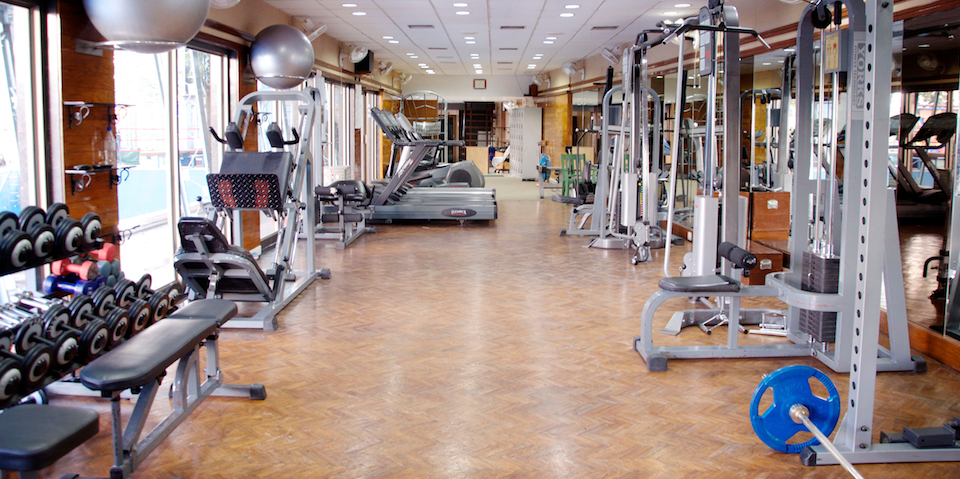

# 💪 The Gym

<p align="center">
  
</p>

<p align="center">
  
  
  
  
</p>

Welcome to The Gym — a sleek, fitness-focused multi-page website designed to showcase a premium gym experience with a modern layout, engaging visuals, and user-friendly navigation.

## ✨ Why this project stands out

- 🏋️ Multi-page gym website with a polished, professional aesthetic
- 🎯 Dedicated sections for trainers, plans, pricing, facilities, and contact info
- 🖼️ Dynamic image slider for promotional gym visuals
- 📱 Responsive layout for desktop and smaller screens
- 💬 Strong brand presence with social media and call-to-action sections
- ⚙️ Built using pure HTML, CSS, and JavaScript for simplicity and speed

## 🧩 Project pages

| Page | Purpose | Highlights |
| --- | --- | --- |
| `Home.html` | Main landing page | Hero/slider, gym highlights, schedule, social proof |
| `Trainers.html` | Trainer profile section | Fitness coaches and expert-led training |
| `Plans.html` | Membership plans | Program categories and gym journey |
| `Pricing.html` | Pricing overview | Cost structure and value proposition |
| `Facility.html` | Facilities overview | Equipment zones, workout spaces, amenities |
| `Contacts.html` | Contact page | Location, social links, and communication details |
| `slide.html` | Standalone slider demo | Bootstrap-like custom image carousel functionality |

## 🏆 Core features

<div align="center">

  
  
  
  
  

</div>

### Included in the experience

- 🏢 Premium fitness brand presentation
- 🧠 Clean and structured page layout
- 🏋️ Dedicated strength, cardio, and ladies-only workout zones
- 📅 Group class schedule such as cycling, yoga, bootcamp, and sculpting
- 📍 Convenient location and contact accessibility
- 🔔 Animated elements and blinking callout effects for a lively feel
- 📸 Image-heavy design inspired by modern gym brands

## 🚀 How to run locally

1. Clone the repository
2. Open the project folder in your browser
3. Launch any page like `Home.html` directly in the browser

Example:

```bash
git clone https://github.com/ankushshinde755/The-Gym.git
cd The-Gym
start Home.html
```

If you are using VS Code or another editor, simply open `Home.html` in a browser preview or Live Server.

## 🛠️ Tech stack

- HTML5
- CSS3
- JavaScript
- Image-based static content
- Responsive front-end design

## 📣 Project vibe

This project captures the energy of a local fitness studio with crisp visuals, strong callouts, and a focus on transformation, discipline, and club membership. It is ideal for showcasing a gym brand online without requiring a full backend setup.

## 🌟 Future ideas

- Add online membership form
- Integrate real booking functionality
- Add testimonials and trainer cards
- Upgrade to React or Next.js for a modern app version
- Add dark mode and motion-rich animations

## 👤 Author

Built with passion for fitness and web design by the The Gym project contributors.

---

<p align="center">
  <strong>🔥 Ready to train harder. Build stronger. Start today. 🔥</strong>
</p>
